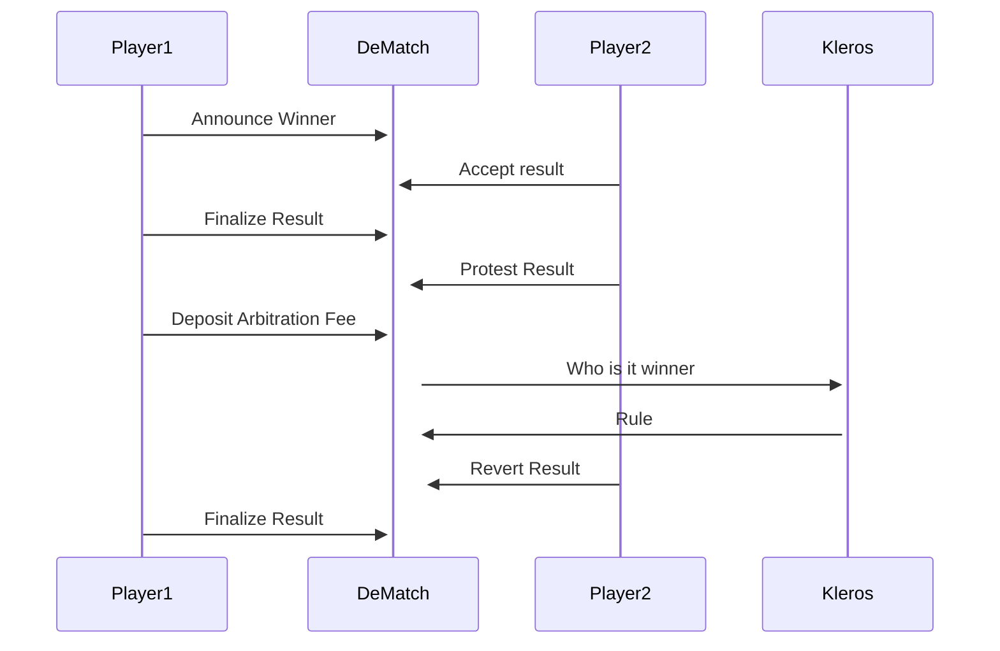

# DeMatch
Dematch is a smart data structure for creating decentralized tournaments on top of ethereum. It's basically an arbitrable ERC-792 compliant smart contract which will contain the result of match ( It can be any match with two players, I think we can generalize it as well for any match ).

## How it works
See it yourself in /contracts/DeMatch.sol - It's pretty readable.


### Example usage existed in a tournament contract at /contracts/SimpleTournaments.sol

## Example App
clone the repo
```
    cd client && yarn && yarn serve
```
It only works in ropsten network

### Video Demo
Coming very very soon. 

[Explainer Video ](https://www.youtube.com/watch?v=6eORGbLiA_g)